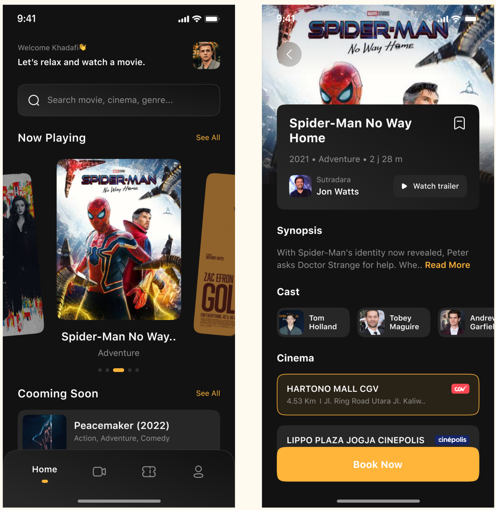
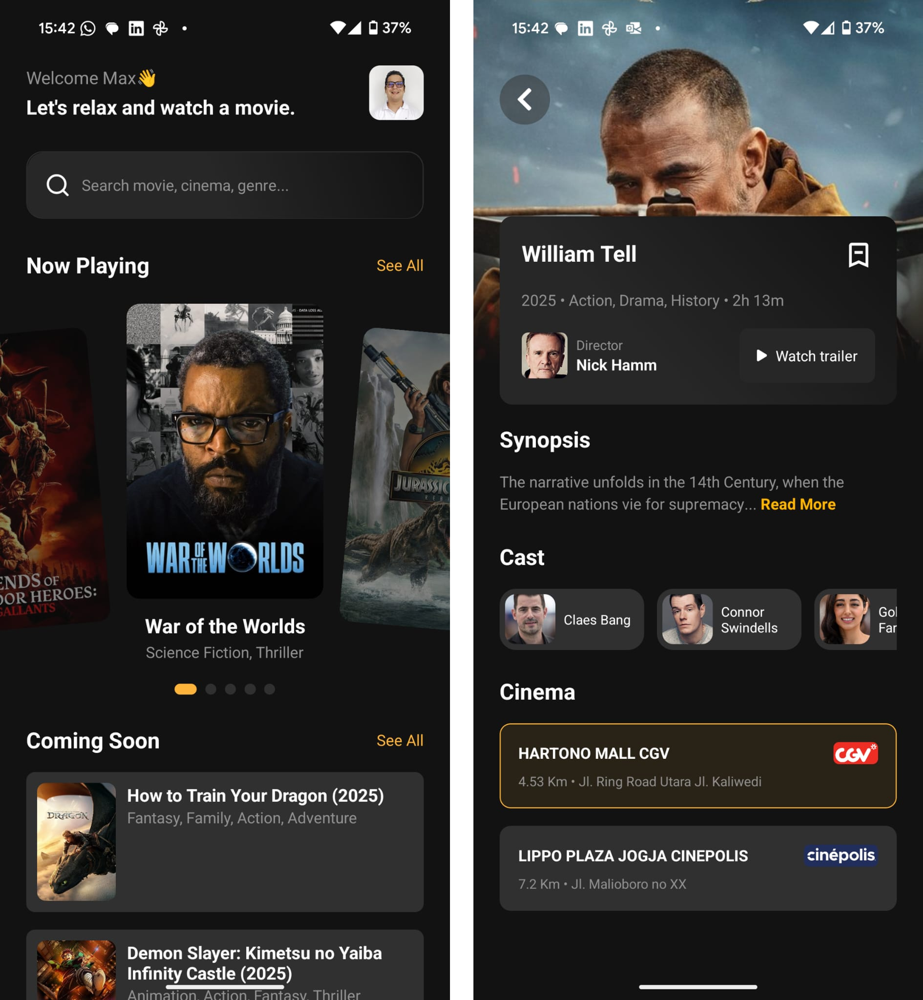

## Movie Catalogue - TMDB

A React Native mobile app built with Expo for browsing and exploring movies from TMDB API.

## Getting Started

First, add your TMDB API Key to a env variables in a `env.local` file. You can you use and replace variables the `env.local.template` 


Next, run the development server:

```bash
npm start
```

Finally, scan the QR code with your Expo Go app in your device or launch Android Studio Emulator in Windows.

## Task 1
### 🛠 Tech Stack

- React Native (UI framework) + TypeScript
- Expo (build & development environment)
- React Navigation (screen navigation)
- Android Studio Emulator (testing on Android devices)

## Task 2
### 🛠 Tech Stack

- Fetch / Axios (API calls) + TypeScript
- Data Validation / Zod

## Preview

The UI follows a picture shared in the project file.

### Target



### Result

